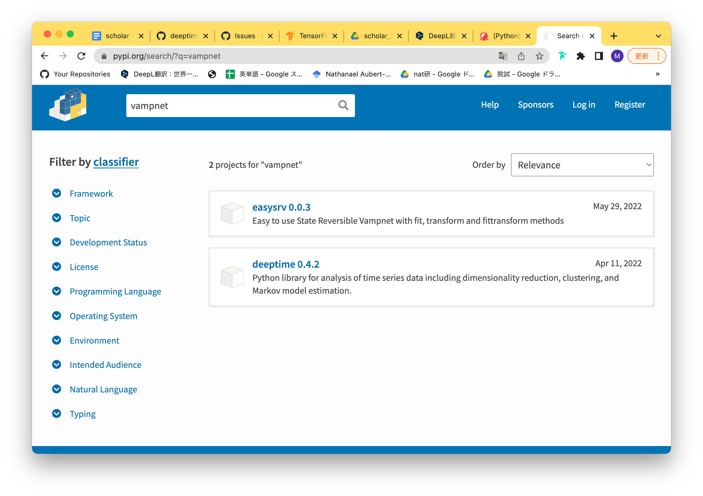

## 試したこと
### 2022/06/29
**[example1](../vampnet/examples/1D_double_well.ipynb)を実行する**  
```import vampnet```  
```ModuleNotFoundError: No module named 'vampnet'```  
がうまく行かない。
1. ```vampnet/```下で、
```bash
python setup.py install
```
2. terminalで
```bash
# Requires the latest pip
pip install --upgrade pip

# Current stable release for CPU and GPU
pip install tensorflow

# Or try the preview build (unstable)
pip install tf-nightly
```
を実行
3. ```pip install vampnet```をファイル内で実行
```
ERROR: Could not find a version that satisfies the requirement vampnet (from versions: none)
ERROR: No matching distribution found for vampnet
WARNING: You are using pip version 20.1.1; however, version 22.1.2 is available.
You should consider upgrading via the '/usr/local/bin/python3.8 -m pip install --upgrade pip' command.
Note: you may need to restart the kernel to use updated packages.
```
```
'/usr/local/bin/python3.8 -m pip install --upgrade pip'
```
をターミナルで実行
```
ERROR: Could not find a version that satisfies the requirement vampnet (from versions: none)
ERROR: No matching distribution found for vampnet
Note: you may need to restart the kernel to use updated packages.
```


3. [ここ](../vampnet/README.md)を実行
```
The examples are jupyter notebooks, so the jupyter package is needed to run them:

http://jupyter.readthedocs.io/en/latest/install.html

This is not needed if you'd like to use the package only.

If you want to run the alanine dipeptide example, you'll also need to install the mdshare package (necessary for the download of the trajectory files):

git clone https://github.com/markovmodel/mdshare.git pip install ./mdshare
```

```
Successfully installed humanfriendly-10.0 mdshare-0.4.2
```
4. [pythonライブラリバージョン問題](https://kajindowsxp.com/pip-unable/)



ここにはなさそう


→
go to the vampnet folder and do
```
python3 setup.py install
```
できた！
### 2022/06/30
[***1D_double_well.ipynb***](../vampnet/1D_double_well.ipynb)を実行する  
エラー集  
1. 
```
adam = optimizers.adam(lr = learning_rate)
AttributeError: module 'keras.optimizers' has no attribute 'adam'
```
→ [この記事](https://qiita.com/hetare/questions/b39b7deacf83e257f2ae)を参考に
```
adam = optimizers.Adam(lr = learning_rate)
```
変更  
2. 

```
Output exceeds the size limit. Open the full output data in a text editor
---------------------------------------------------------------------------
AttributeError                            Traceback (most recent call last)
/Users/maya/Desktop/lab/deeptime/deeptime/vampnet/1D_double_well.ipynb 
---> 64     hist = model.fit([X1_train, X2_train], Y_train ,batch_size=batch_size, epochs=nb_epoch, verbose=0,
```
```
File "/Users/maya/Desktop/lab/deeptime/deeptime/vampnet/vampnet/vampnet.py", line 660, in _prep_data  *
        b = tf.to_float(shape[0])

    AttributeError: module 'tensorflow' has no attribute 'to_float'
```
→ [参考](https://github.com/google/tangent/issues/95)
```
deeptime/deeptime/vampnet/vampnet/vampnet.py
```
の660行目を変更
```
# b = tf.to_float(shape[0])
b = tf.cast(shape[0])
```
次のエラー
```
File "/Users/maya/Desktop/lab/deeptime/deeptime/vampnet/vampnet/vampnet.py", line 661, in _prep_data  *
        b = tf.cast(shape[0])

    TypeError: Missing required positional argument
```
```
# b = tf.to_float(shape[0])
        b = tf.cast(shape[0], tf.float32)
```
これに変更
3. 
```
 File "/Users/maya/Desktop/lab/deeptime/deeptime/vampnet/vampnet/vampnet.py", line 608, in _inv  *
        eigval_all, eigvec_all = tf.self_adjoint_eig(x)

    AttributeError: module 'tensorflow' has no attribute 'self_adjoint_eig'
```
[参考](https://aiacademy.jp/media/?p=1610)

4. 
```
 File "/Users/maya/Desktop/lab/deeptime/deeptime/vampnet/vampnet/vampnet.py", line 608, in _inv  *
        eigval_all, eigvec_all = tf.self_adjoint_eig(x)

    AttributeError: module 'tensorflow' has no attribute 'self_adjoint_eig'
```
vampnet.py 698行
```
 # eigval_all, eigvec_all = tf.self_adjoint_eig(x)
   eigval_all, eigvec_all = tf.SelfAdjointEig(x)
```

### 2022/07/12  
**dockerを使う**
- tensorflow1を使いたい！[イメージ](https://hub.docker.com/layers/tensorflow/tensorflow/tensorflow/1.15.3-py3/images/sha256-3f0cd0e85380afb2af3a30703de75a1ec4f3facb00d630714fb2d80d3e36f77f?context=explore)
- dockerのコンテナ内でgitを使う
https://www.slideshare.net/KazuhiroSuga/dockergit
```apt-get update && apt-get install -y git```
- VScodeつかう [参考](https://qiita.com/Yuki_Oshima/items/d3b52c553387685460b0)
